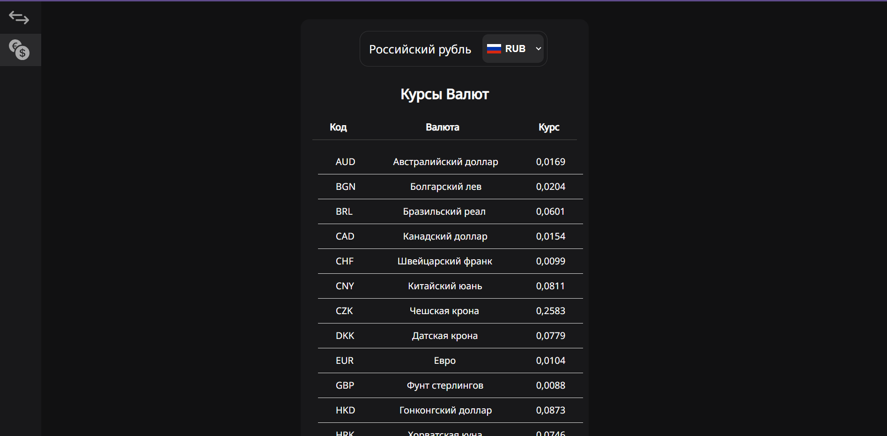
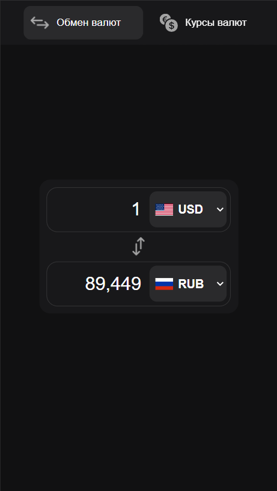
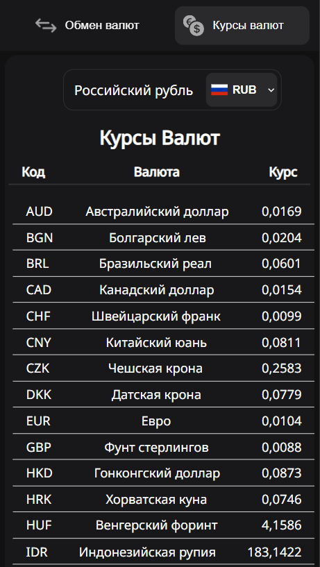

# Currency Exchanger

Currency Exchanger is a Single Page Application (SPA) that allows you to easily convert between different currencies. You can either convert one currency to another or view the exchange rate for a specific currency.

## Features

- **Currency Conversion**: Convert any amount from one currency to another.
- **Exchange Rate Viewing**: View the current exchange rate for a specific currency.

## Technologies Used

- **HTML**
- **CSS**
- **JavaScript**
- **WebPack**

## Screenshots

### Desktop View

### Mobile View

## Live Demo

Check out the live demo on GitHub Pages: [Currency Exchanger](https://mkh1n.github.io/currency-exchanger/)
